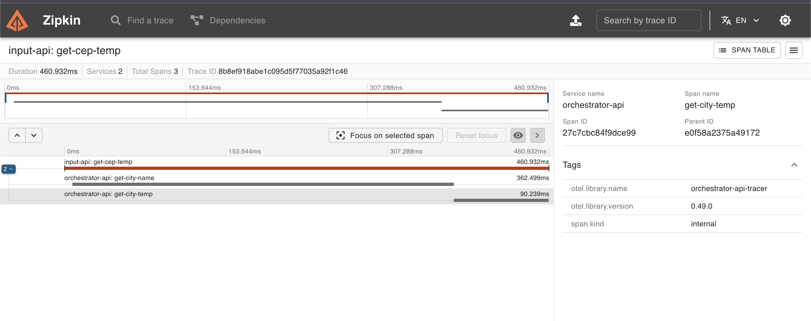

<p align="center">
  
</p>
<p align="center">
    <h1 align="center">GO-EXPERT TEMP BY CEP OTEL</h1>
</p>
<p align="center">
    <em>Desafio da pós em GO Expert</em>
</p>
<p align="center">
	
	
	
<p>
<p align="center">
    <em>Developed with ❤️ by Mhayk Whandson</em>
</p>
<p align="center">
		<em>Developed with the language, software and tools below.</em>
</p>
<p align="center">
	
	
	
	
</p>
<hr>


# Lab GO: Sistema de Temperatura por CEP - Observalidade com OpenTelemetry e Zipkin

## Descrição do Desafio
Este projeto consiste em dois serviços, A e B, para validação de CEP e obtenção de informações meteorológicas com base na localização do CEP.

## 🚀 Iniciando

1. Clone o repositório:
    ```sh
    git clone git@github.com:mhayk/GO-Expert-temp-by-cep-otel.git
    ```

2. Execute o comando abaixo na pasta raiz do projeto para iniciar o ambiente de desenvolvimento:
    ```sh
    docker-compose up -d
    ```

   Para parar os serviços:
    ```sh
    docker-compose down
    ```

### Zipkin

Para acessar a telemetria use o seguinte endereço do `zipkin` e após realizar uma requisição clique no
botão "`RUN QUERY`":

- `http://localhost:9411/zipkin`

## 🛠️ Endpoints

Veja abaixo os comportamentos de cada serviço.

### Serviço A

Você pode acessar o **serviço A** em `http://localhost:8080/cep` e enviar um cep valido no formato JSON. O
arquivo `api/get_temperatures.http` contém exemplos de uso.

Comportamento:

- **POST** `/`
    - Request Body:
      ```json
      {
        "cep": "69304350"
      }
      ```
    - Responses:
        - 200: Encaminha para o Serviço B.
        - 422: `invalid zipcode` caso seja inválido.

### Serviço B

Você pode acessar o serviço B em `http://localhost:8081/cep/{cep}`. O arquivo `api/get_temperatures.http` contém exemplos de
uso.

- **GET** `/{cep}`
    - Responses:
        - 200: `{ "city": "Boa Vista", "temp_C": 34.99, "temp_F": 94.98, "temp_K": 308.14 }`
        - 404: `can not find zipcode` caso não encontre o CEP.
        - 422: `invalid zipcode` caso o CEP seja inválido.

### Zipkin

Para acessar a telemetria use o seguinte endereço do `zipkin` e após realizar uma requisição clique no
botão "`RUN QUERY`":

- `http://localhost:9411/zipkin`

## 🧪 Testes

Após iniciar o ambiente de desenvolvimento, você pode testar com o cURL de exemplo abaixo ou com o
arquivo `api/get_temperatures.http`:

```sh
curl -X POST http://localhost:8080/cep -H "Content-Type: application/json" -d '{"cep": "69304350"}'
```

```sh
curl http://localhost:8081/cep/69304350
```

---

# Observability with OpenTelemetry and Zipkin

This project consists of two services, A and B, for validating zip codes and obtaining weather information based on the
zip code location.

## Project Structure

- **Service A**: Responsible for receiving and validating the zip code.
- **Service B**: Responsible for orchestration, validating the zip code, obtaining the location, and returning formatted
  weather information.
- The [Zipkin](https://zipkin.io/) lib was used for request tracing. It is a distributed tracing tool that helps
  collect, visualize, and analyze request tracing data in microservices.
- The [OpenTelemetry](https://opentelemetry.io/) was used to collect distributed traces and metrics from the services.

## Traces: Zipkin
